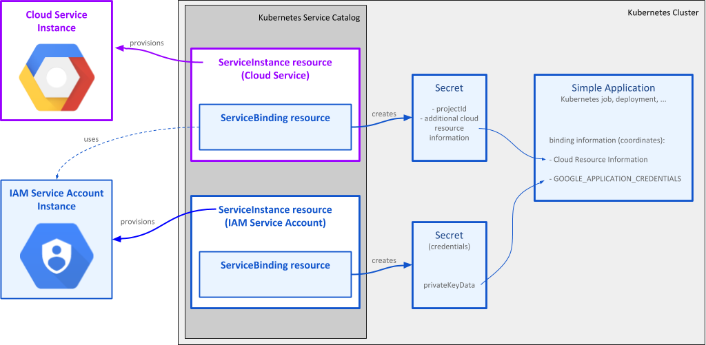
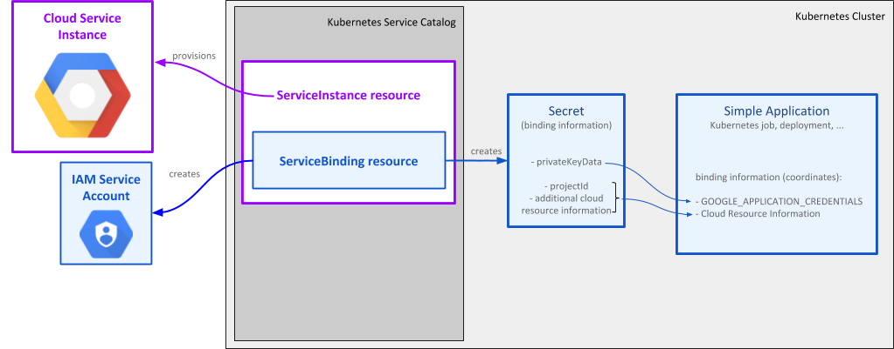

# Kubernetes Service Catalog Samples

These samples use Kubernetes Service Catalog to provision and use Google Cloud Platform
service classes from a Kubernetes cluster.

## Prerequisites

Successful use of these samples requires:

*   A Kubernetes cluster, minimum version 1.8.x.
*   Kubernetes Service Catalog and the Google Cloud Platform Service Broker [installed](
    https://cloud.google.com/kubernetes-engine/docs/how-to/add-on/service-broker/install-service-catalog).
*   The [Service Catalog
    CLI](https://github.com/kubernetes-incubator/service-catalog/blob/master/docs/install.md#installing-the-service-catalog-cli)
    (`svcat`) installed.

Some samples may also require you to [enable
APIs](https://console.cloud.google.com/apis/dashboard) in the Google Cloud Platform Console.

## Viewing Resources

You can view your provisioned Service Instances and Bindings in the [Service
Catalog](https://console.cloud.google.com/kubernetes/serviceinstance) in the Google Cloud Console.

You can also view the underlying resources by viewing the appropriate page in the Google Cloud
Console for that resource. For example, Spanner instances can be seen at:
https://console.cloud.google.com/spanner/instances

## Samples and Features

The Service Catalog samples demonstrate use of the services provided by the
Service Broker.

| Service                               | Admin job | Application Service Account | Per-Binding Service Account |
| ------------------------------------- |:---------:|:---------------------------:|:---------------------------:|
| [BigQuery](bigquery/)                 |     *     |             *               |               *             |
| [Cloud Bigtable](cloud-bigtable/)     |     *     |             *               |               *             |
| [Cloud Pub/Sub](cloud-pubsub/)        |           |             *               |               *             |
| [Cloud Spanner](cloud-spanner/)       |     *     |             *               |               *             |
| [Cloud SQL - MySQL](cloud-sql-mysql/) |           |             *               |                             |
| [Cloud Storage](cloud-storage/)       |     *     |                             |               *             |

### Admin job

Admin jobs are used during the life cycle of an application to perform administrative tasks,
such as database maintenance. Administrative tasks typically require permissions beyond those
needed by the application which serves user traffic. Samples that use admin jobs to perform
such tasks create a separate *binding* which gives the admin job permissions to perform
the administrative tasks. On the other hand, the binding created for the main application
typically grants user-level privileges.

The samples perform administrative tasks in a separate application using a separate service account
to demonstrate more secure application architecture where application serving user traffic does not
have administrator privileges.

### Application Service Account

Even though the sample applications only use a single Google Cloud service, a typical application
may use a number of different Google Cloud services. For example, in addition to using a
database service such as Spanner or Cloud SQL to store data, an application may use Pub/Sub
to publish or consume event streams or Cloud Storage to store large objects such as photos
in a Cloud Storage bucket.

In those cases, an application should use a single service account for authentication with all
Google Cloud services. Some of the samples demonstrate this technique by creating a separate
service account and using it in the context of binding to the cloud service instance.
Creating the binding with an existing service account will:

*   Grant the service account the specified roles needed to access the resources associated with
    the instance.
*   Make the information necessary for accessing the service instance available to the application
    via a Kubernetes secret.

The application obtains the service account identity from another source, typically another secret
such as one created by binding to a "Cloud IAM Service Account" instance.

### Per-Binding Service Account

Simple applications only use a single Google Cloud service. To make creation of such applications
easier, a service account can be optionally created as part of creating a binding.
When this option is enabled, creating the binding will:

*   Create a new service account.
*   Create a private key for the service account.
*   Grant the service account the specified roles needed to access the resources associated with
    the instance.
*   Make the service account private key and the information necessary for accessing the service
    instance available to the application via a Kubernetes secret.

## Troubleshooting

The creation of a Service Instance creates a new resource of the underlying type (eg. BigQuery
Dataset or Cloud Pub/Sub Topic). If that underlying resource already exists, the creation of the
Service Instance will fail.

Concurrent operations, both creation and deletion, of Service Instances and Bindings may have
unexpected consequences. Users should not create or delete a second binding to an instance until
the first operation has completed. Users should delete all bindings to an instance before the
instance itself can be deleted. Users should wait for provisioning or binding to complete before
deleting the instance or binding.

Here are some common error scenarios with sample error messages and troubleshooting tips.

### Previous Operation Still In Progress

**Possible Errors**:

*   `Binding "b1" to instance "i1" in broker "default" in "projects/my-project"
    has invalid status <STATUS>`
*   `Instance "i1" in broker "default" in "projects/my-project" has invalid
    status <STATUS>`

**Reason**: Creating two bindings to the same service instance at the same time
is not allowed.

**Solution**: Delete the failed binding, wait for the first binding to complete,
then recreate the second binding.

### Instance Has Remaining Bindings

**Possible Errors**:

*   `Failed to delete instance "i1" under broker "default" in
    "projects/my-project" with existing bindings`
*   The status for the service instance becomes
    `DeprovisionBlockedByExistingCredentials` after deletion.

**Solution**: Delete all the bindings to a service instance. If the bindings are
deleted successfully, the instance will be deleted eventually.

### Underlying Resource Already Exists

**Possible Error**:

*   `Resource 'dataset' of type 'bigquery.v2.dataset' already exists, and create
    policy CREATE does not allow acquisition.`

**Solution**: Change the ID you are using to uniquely identify your underlying
resource (ex: `datasetId` for a BigQuery Dataset) because a resource with that
ID already exists. For some services (ex: Cloud Storage), IDs must be globally
unique across projects, so you may want to use your project ID as the prefix.
For some other services (ex: Cloud SQL), some IDs will be retained after the
deletion for a certain period of time so deleting the original resource and
creating it again with the same ID will also fail.

### Permission Denied for Service Accounts

**Possible Errors**:

* `permission denied` errors
* `not authorized` errors

**Reason**:

If a [Cloud IAM Service
Account](https://cloud.google.com/iam/docs/service-accounts) is deleted before
all project-level roles are removed and then created again, permission checks
for the previously existing roles will unexpectedly fail.

**Solutions**:

1.  Always create a fresh service account with an ID you have never used before.
1.  Or, manually clean up all the project-level roles assigned to the service
    account and then add them back. Please follow [this
    guide](https://cloud.google.com/iam/docs/granting-changing-revoking-access#revoking_access_to_team_members).

### Creating Bindings with Non-existent Service Accounts

**Possible Errors**:

*   `500` error with error messages containing `create binding deployment
    failed: generic::invalid_argument` and `A service error has occurred. Please
    retry your request. If the error persists, please report it.`
*   `400` error with error messages containing `Invalid argument`

**Solution**: Delete the failed binding, check the spelling of the service
account ID if it is supposed to exist already or [create the service
account](https://cloud.google.com/kubernetes-engine/docs/how-to/add-on/service-broker/use-service-catalog#bind_to_an_instance)
referenced in the binding, then recreate the binding.
