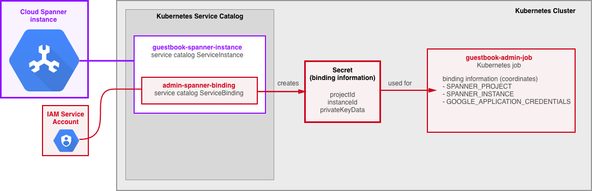
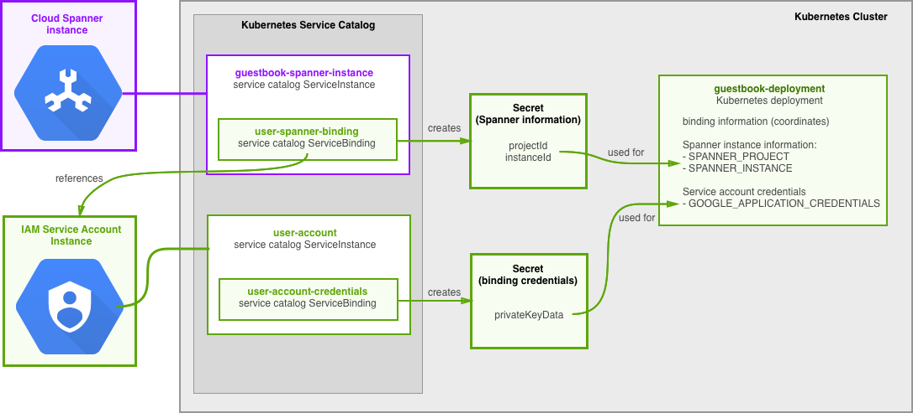

# Service Catalog Sample - Cloud Spanner

This sample demonstrates how to build a simple Kubernetes web application using
[Kubernetes Service
Catalog](https://kubernetes.io/docs/concepts/service-catalog/) and a [Google
Cloud Platform Service
Broker](https://cloud.google.com/kubernetes-engine/docs/concepts/add-on/service-broker),
an implementation of the [Open Service
Broker](https://www.openservicebrokerapi.org/) standard.

The sample highlights a number of Kubernetes and Open Service Broker concepts:

*   Using Service Catalog and the Service Broker to *provision*
    a *service instance*.
*   *Binding* the provisioned *service instance* to a Kubernetes application.
*   Use of the *binding* by the application to access the *service instance*.

The sample application is a simple guestbook using
[Cloud Spanner](https://cloud.google.com/spanner/); it allows users to leave
simple guestbook entries and list all entries in the guestbook.

At the core of the sample is a Spanner instance, which is provisioned in your
project by the Service Broker. The Spanner instance is accessed by two
Kubernetes applications: an admin job and a guestbook web deployment.
The applications access the Spanner instance using *bindings*.

The admin job uses a binding which will allow it to create a database and
a guestbook table in the Spanner instance.

The guestbook web deployment uses a binding which will only allow user-level
access to the Spanner instance - to read from and write to the table in the
Cloud Spanner database.

## Objectives

To deploy and run the sample application, you must:

1.  Create a new namespace for all Kubernetes resources used by the sample.
2.  Provision a Spanner instance using Kubernetes Service Catalog.
3.  Administer the Spanner instance using a Kubernetes job:
      1.  Create a binding for the admin job.
      2.  Deploy the admin job in your Kubernetes cluster.
4.  Deploy the guestbook application:
      1.  Provision a service account for the guestbook application.
      2.  Create binding to the Spanner instance with the guestbook application
          service account.
      3.  Create the Kubernetes guestbook deployment.
5.  Interact with the guestbook application via a web API.
6.  Deprovision and delete all resources used by the sample.

## Before you begin

Review the [information](../README.md) applicable to all Service Catalog
samples, including [prerequisites](../README.md#prerequisites):

*   A Kubernetes cluster, minimum version 1.8.x.
*   Kubernetes Service Catalog and the Service Broker [installed](
    https://cloud.google.com/kubernetes-engine/docs/how-to/add-on/service-broker/install-service-catalog).
*   The Service Catalog CLI (`svcat`) [installed](
    https://github.com/kubernetes-incubator/service-catalog/blob/master/docs/install.md#installing-the-service-catalog-cli).

## Step 1: Create a new Kubernetes namespace

```shell
kubectl create namespace spanner-guestbook
```

## Step 2: Provision Cloud Spanner instance

Provision an instance of Cloud Spanner:

```shell
kubectl create -f ./manifests/guestbook-spanner-instance.yaml
```

This command will use the Kubernetes Service Catalog to provision an empty
instance of Cloud Spanner using parameters in
[guestbook-spanner-instance.yaml](./manifests/guestbook-spanner-instance.yaml).

Check on the status of the instance provisioning:

```shell
svcat get instance --namespace spanner-guestbook guestbook-spanner-instance
```

The instance is provisioned when its status is `Ready`.

## Step 3: Administer the Cloud Spanner Instance

The admin job sets up the Spanner instance by creating a database and
a table. To do so, it requires administrator privileges granted on the spanner
instance.

To express the intent of granting the administrator privileges to the admin job,
you will create a *binding* using the parameters in
[admin-spanner-binding.yaml](manifests/admin-spanner-binding.yaml). Creating the
binding will:

*   Create a service account for the admin job to authenticate with Cloud
    Spanner.
*   Grant the service account the `roles/spanner.admin` role.
*   Store the service account private key (`privateKeyData`) and the Spanner
    instance connection information (`projectId`, `instanceId`) in a Kubernetes
    secret.

The admin job consumes the information stored in the secret via
environment variables `GOOGLE_APPLICATION_CREDENTIALS`, `SPANNER_PROJECT`, and
`SPANNER_INSTANCE`. Review the admin job configuration in
[guestbook-admin-job.yaml](manifests/guestbook-admin-job.yaml).



### Step 3.1: Create Binding for the Admin Job

Create the admin binding to the Cloud Spanner instance using the parameters in
[admin-spanner-binding.yaml](manifests/admin-spanner-binding.yaml):

```shell
kubectl create -f ./manifests/admin-spanner-binding.yaml
```

The command will use the Kubernetes Service Catalog to create a binding to the
Spanner instance provisioned earlier.

Check on the status of the binding operation:

```shell
svcat get binding --namespace spanner-guestbook admin-spanner-binding
```

Once the binding status is `Ready`, view the Kubernetes secret containing the
result of the binding (the default name of the secret is the same as the name
of the binding resource - `admin-spanner-binding`)

```shell
kubectl get secret --namespace spanner-guestbook admin-spanner-binding -oyaml
```

Notice the values `privateKeyData`, `projectId`, and `instanceId` which contain
the result of the binding, ready for the admin job to use.

### Step 3.2: Create the Admin Job

The admin job is executed once to initialize the Cloud Spanner instance.
It creates a database and with a table. Create the admin job using parameters
in [guestbook-admin-job.yaml](manifests/guestbook-admin-job.yaml).

```shell
kubectl create -f ./manifests/guestbook-admin-job.yaml
```

Check on completion of the job:

```shell
kubectl get job --namespace spanner-guestbook guestbook-admin-job
```

You can examine the Cloud Spanner instance and the newly created database in the
[Google Cloud Console](https://console.cloud.google.com/spanner/instances/guestbook/databases).

The Spanner instance is now ready to be used by the `guestbook` application.

## Step 4: Deploy the Guestbook

The `guestbook` deployment reads from and writes to the database table. It
performs no administrative operations. Therefore, it only requires database user
level access and will assume the identity of a service account with user level
privileges.



Even though the `guestbook` deployment only uses Cloud Spanner, a typical
application may use a number of different Google Cloud services. For example,
the `guestbook` can be extended to store large objects (guest photos) in
Cloud Storage bucket. In this case, the application will use a single service
account rather than creating a new one for each binding.

The `guestbook` follows this pattern. You will

*   Create a service account instance by provisioning a special
    'service account' service.
*   Create a binding to the service account instance. This will:
      *    Create a service account private key.
      *    Store the private key in the Kubernetes secret as `privateKeyData`.
*   Create a binding to Cloud Spanner instance, referencing the service account.
    This will:
      *    Grant the service account the roles needed to use the Cloud Spanner
           instance.
      *    Store the Spanner instance connection information (`projectId`,
           `instanceId`) in a Kubernetes secret.

The `guestbook` deployment consumes **both** secrets via environment variables
`GOOGLE_APPLICATION_CREDENTIALS`, `SPANNER_PROJECT`, and `SPANNER_INSTANCE`.
Review the guestbook deployment configuration in
[guestbook-deployment.yaml](manifests/guestbook-deployment.yaml).

### Step 4.1: Provision User Service Account

Create the user service account using the parameters in
[user-account.yaml](manifests/user-account.yaml):

```shell
kubectl create -f ./manifests/user-account.yaml
```

Check on the status of the service account provisioning:

```shell
svcat get instance --namespace spanner-guestbook user-account
```

Once the status is `Ready`, create a binding to make the service account
private key available in a secret, using the parameters in
[user-account-credentials.yaml](manifests/user-account-credentials.yaml).

```shell
kubectl create -f ./manifests/user-account-credentials.yaml
```

Check the binding status:

```shell
svcat get binding --namespace spanner-guestbook user-account-credentials
```

When the binding status is `Ready`, view the secret containing the service
account credentials:

```shell
kubectl get secret --namespace spanner-guestbook user-account-credentials -oyaml
```

Notice the `privateKeyData` value which contains the service account private
key.

### Step 4.2: Grant user service account access to Spanner

Create the user binding to the Cloud Spanner instance using the parameters in
[user-spanner-binding.yaml](manifests/user-spanner-binding.yaml):

```shell
kubectl create -f ./manifests/user-spanner-binding.yaml
```

Check the binding status:

```shell
svcat get binding --namespace spanner-guestbook user-spanner-binding
```

Once the `user-spanner-binding` status is `Ready`, view the secret containing
the result of the binding (the default name of the secret is the same as the
name of the binding resource - `user-spanner-binding`):

```shell
kubectl get secret --namespace spanner-guestbook user-spanner-binding -oyaml
```

Notice the `projectId` and `instanceId` values. They are referenced from
[guestbook-deployment.yaml](manifests/guestbook-deployment.yaml) and tell
the guestbook deployment which database to access.

### Step 4.3: Create the Guestbook Deployment

Create the Kubernetes deployment using configuration in
[guestbook-deployment.yaml](manifests/guestbook-deployment.yaml). The
configuration uses two secrets to obtain service account credentials
(`user-account-credentials`) and Spanner instance `projectId` and `instanceId`
(`user-spanner-binding`).

```shell
kubectl create -f ./manifests/guestbook-deployment.yaml
```

Wait for the deployment to complete and then find the the Kubernetes service
external IP address:

```shell
kubectl get service --namespace spanner-guestbook
IP= ... # External IP address of the Kubernetest load balancer.
```

or:

```shell
IP=$(kubectl get service --namespace spanner-guestbook guestbook-service -o=jsonpath='{.status.loadBalancer.ingress[0].ip}')
```

## Step 5: Use the Guestbook application

Use the IP address of the Kubernetes load balancer service along with a `curl`
command to access the application.

`GET /entries` will return list of guestbook entries in JSON format:

```shell
# Query the guest book entries:
curl http://${IP}/entries
{"entries":[]}
```

An `HTTP POST` is used to add a new entry into the guestbook:
```shell
# Create a new entry:
curl http://${IP}/entries -d '{"name": "GKE", "message": "I love Open Service Broker"}'
```

You can then send another `GET /entries` to view the new entry:
```shell
# Query the entries again:
curl http://${IP}/entries
{"entries":[{"name":"GKE","message":"I love Open Service Broker"}]}
```

## Step 6: Cleanup

To avoid incurring charges to your Google Cloud Platform account for the
resources used in this sample, delete and deprovision all resources.

An expedient way is to delete the Kubernetes namespace; however make sure that
the namespace doesn't contain any resources you want to keep:

```shell
kubectl delete namespace spanner-guestbook
```

Alternatively, delete all resources individually by running the following
commands:

**Note:** You may have to wait several minutes between steps to allow for the
previous operations to complete.

Delete the application deployment and the load balancer service:

```shell
kubectl delete -f ./manifests/guestbook-deployment.yaml
```

Delete the admin Kubernetes job:

```shell
kubectl delete -f ./manifests/guestbook-admin-job.yaml
```

Delete the user binding to the Cloud Spanner instance:

```shell
kubectl delete -f ./manifests/user-spanner-binding.yaml
```

Delete the admin binding to the Cloud Spanner instance. This also deletes
the service account created for the admin binding.

```shell
kubectl delete -f ./manifests/admin-spanner-binding.yaml
```

Unbind the user service account:

```shell
kubectl delete -f ./manifests/user-account-credentials.yaml
```

Deprovision the user service account:

```shell
kubectl delete -f ./manifests/user-account.yaml
```

Deprovision the Cloud Spanner instance:

```shell
kubectl delete -f ./manifests/guestbook-spanner-instance.yaml
```

If the `spanner-guestbook` namespace contains no resource you wish to keep,
delete it:

```shell
kubectl delete namespace spanner-guestbook
```

## Troubleshooting

Please find the troubleshooting information
[here](../README.md#troubleshooting).
